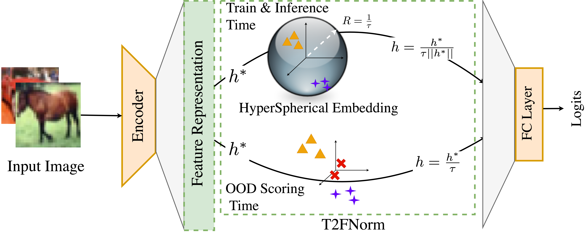

# T2FNorm: Train-time Feature Normalization for OOD Detection in Image Classification
This codebase provides a Pytorch implementation for the paper to appear at CVPRW-2024: "T2FNorm: Train-time Feature Normalization for OOD Detection in Image Classification". It builds upon [OpenOOD](https://github.com/Jingkang50/OpenOOD).

## Abstract
Neural networks are notorious for being overconfident predictors, posing a significant challenge to their safe deployment in real-world applications. While feature normalization has garnered considerable attention within the deep learning literature, current train-time regularization methods for Out-of-Distribution(OOD) detection are yet to fully exploit this potential. Indeed, the naive incorporation of feature normalization within neural networks does not guarantee substantial improvement in OOD detection performance. In this work, we introduce T2FNorm, a novel approach to transforming features to hyperspherical space during training, while employing non-transformed space for OOD-scoring purposes. This method yields a surprising enhancement in OOD detection capabilities without compromising model accuracy in in-distribution(ID). Our investigation demonstrates that the proposed technique substantially diminishes the norm of the features of all samples, more so in the case of out-of-distribution samples, thereby addressing the prevalent concern of overconfidence in neural networks. The proposed method also significantly improves various post-hoc OOD detection methods.

## Method Illustration


## Datasets and Packages
Please download the datasets and required packages from [OpenOOD](https://github.com/Jingkang50/OpenOOD).

### Example Scripts for Training and Inference
Use the following scripts for training and inferencing the model trained with T2FNorm regularization on different datasets:

- **CIFAR-10:**
  ```bash
  bash scripts/ood/t2fnorm/cifar10_train_t2fnorm.sh
  bash scripts/ood/t2fnorm/cifar10_test_t2fnorm.sh
  ```
- **CIFAR-100:**
  ```bash
  bash scripts/ood/t2fnorm/cifar100_train_t2fnorm.sh
  bash scripts/ood/t2fnorm/cifar100_test_t2fnorm.sh
  ```
- **ImageNet-200:**
  ```bash
  bash scripts/ood/t2fnorm/imagenet200_train_t2fnorm.sh
  bash scripts/ood/t2fnorm/imagenet200_test_t2fnorm.sh
  ```
- **ImageNet-1k:**
  ```bash
  bash scripts/ood/t2fnorm/imagenet_train_t2fnorm.sh
  bash scripts/ood/t2fnorm/imagenet_test_t2fnorm.sh
  ```
The model trained with T2FNorm regularization can be readily used with any postprocessor (after feature scaling with tau). By default, we use T2FNorm postprocessor (feature scaling with tau + scale postprocessor).

#### Pre-trained checkpoints
Pre-trained models are available in the given links:
- CIFAR-10 [[Google Drive]](https://drive.google.com/file/d/1FchVmaDodfsSE-eyA6FjnEZ7FtFm0v4u/view?usp=sharing): ResNet-18 classifiers trained on CIFAR-10 datasets with T2FNorm regularization across 3 trials.
- CIFAR-100 [[Google Drive]](https://drive.google.com/file/d/16bEDcPPjPkt4KmnqurfGnI6gPLIwZJc8/view?usp=sharing): ResNet-18 classifiers trained on CIFAR-100 datasets with T2FNorm regularization across 3 trials.
- ImageNet-200: Coming soon.
- ImageNet-1k: Coming soon.

#### Results

- CIFAR-10

| datasets   | FPR@95       | AUROC        | AUPR_IN      | AUPR_OUT     | ACC          |
|:-----------|:-------------|:-------------|:-------------|:-------------|:-------------|
| cifar100   | 32.27 ± 0.34 | 91.47 ± 0.07 | 92.09 ± 0.06 | 90.26 ± 0.08 | 94.69 ± 0.07 |
| tin        | 22.17 ± 0.37 | 94.30 ± 0.11 | 95.64 ± 0.08 | 92.32 ± 0.20 | 94.69 ± 0.07 |
| nearood    | 27.22 ± 0.35 | 92.88 ± 0.09 | 93.86 ± 0.07 | 91.29 ± 0.14 | 94.69 ± 0.07 |
| mnist      | 2.24 ± 0.97  | 99.53 ± 0.20 | 97.99 ± 0.77 | 99.93 ± 0.03 | 94.69 ± 0.07 |
| svhn       | 4.22 ± 0.42  | 99.13 ± 0.14 | 98.08 ± 0.24 | 99.67 ± 0.06 | 94.69 ± 0.07 |
| texture    | 18.94 ± 2.52 | 95.84 ± 0.60 | 97.28 ± 0.41 | 93.66 ± 0.94 | 94.69 ± 0.07 |
| places365  | 21.43 ± 1.25 | 94.79 ± 0.36 | 88.07 ± 0.85 | 98.31 ± 0.12 | 94.69 ± 0.07 |
| farood     | 11.71 ± 0.55 | 97.32 ± 0.13 | 95.36 ± 0.05 | 97.89 ± 0.23 | 94.69 ± 0.07 |

- CIFAR-100

| datasets   | FPR@95       | AUROC        | AUPR_IN      | AUPR_OUT     | ACC          |
|:-----------|:-------------|:-------------|:-------------|:-------------|:-------------|
| cifar10    | 70.74 ± 2.56 | 75.29 ± 1.07 | 74.56 ± 1.50 | 72.90 ± 1.01 | 76.43 ± 0.13 |
| tin        | 50.73 ± 0.62 | 83.51 ± 0.06 | 88.64 ± 0.11 | 74.01 ± 0.26 | 76.43 ± 0.13 |
| nearood    | 60.74 ± 1.57 | 79.40 ± 0.52 | 81.60 ± 0.78 | 73.45 ± 0.48 | 76.43 ± 0.13 |
| mnist      | 36.39 ± 4.92 | 86.97 ± 2.14 | 70.57 ± 4.01 | 97.32 ± 0.40 | 76.43 ± 0.13 |
| svhn       | 40.28 ± 2.85 | 86.97 ± 0.87 | 78.99 ± 1.65 | 93.33 ± 0.40 | 76.43 ± 0.13 |
| texture    | 70.29 ± 4.80 | 76.83 ± 1.67 | 83.16 ± 1.72 | 64.29 ± 1.73 | 76.43 ± 0.13 |
| places365  | 54.55 ± 0.55 | 81.37 ± 0.38 | 64.64 ± 0.83 | 92.43 ± 0.15 | 76.43 ± 0.13 |
| farood     | 50.38 ± 2.43 | 83.04 ± 0.95 | 74.34 ± 1.45 | 86.84 ± 0.55 | 76.43 ± 0.13 |

- ImageNet-200: Coming soon.

- ImageNet-1k: Coming soon.

### Please consider citing our work if you find it useful.
```
@misc{regmi2023t2fnorm,
      title={T2FNorm: Extremely Simple Scaled Train-time Feature Normalization for OOD Detection}, 
      author={Sudarshan Regmi and Bibek Panthi and Sakar Dotel and Prashnna K. Gyawali and Danail Stoyanov and Binod Bhattarai},
      year={2023},
      eprint={2305.17797},
      archivePrefix={arXiv},
      primaryClass={cs.CV}
}
```
Also, please consider citing [OpenOOD](https://github.com/Jingkang50/OpenOOD) if you find this codebase useful.
